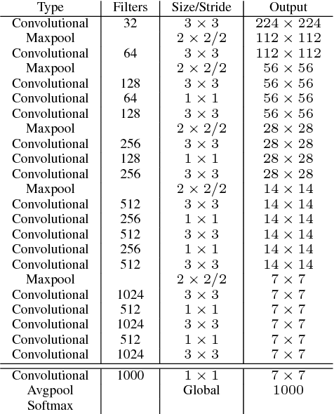
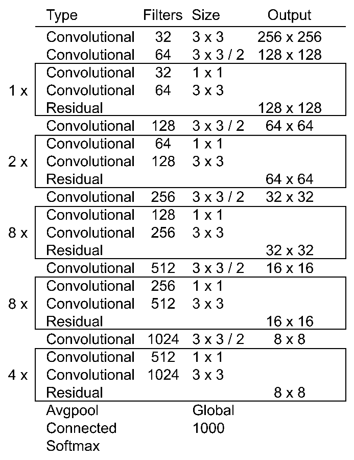

## Implementation of DarkNet on PyTorch

DarkNet19 and DarkNet53 are used as a feature extractor in [YOLO9000](https://arxiv.org/pdf/1612.08242.pdf), [YOLOv3](https://pjreddie.com/media/files/papers/YOLOv3.pdf) respectively.


<div align='center'>
  
  
</div>


## Description:


Run:
```
   git clone https://github.com/yakhyo/DarkNet.git
   cd DarkNet
   python main.py --batch-size 64 [data folder]

```

## Content:

- Data
- Training
- Evaluation and Inference

## Data:

- Download the training files from [here]() and place them as shown below:
